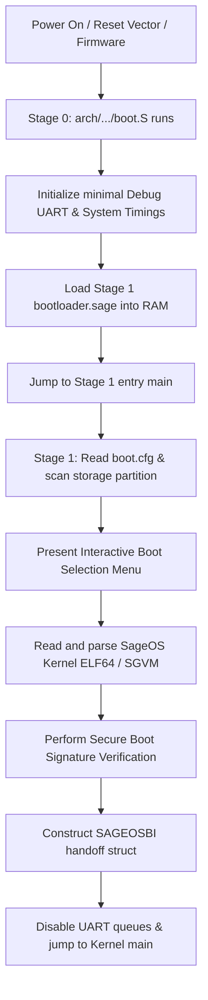

# SageBoot: Unified Bootloader for SageOS

SageBoot is the unified, modular, multi-architecture bootloader for SageOS. It provides standard low-level hardware initialization, memory discovery, configuration parsing, secure kernel validation, and handoff for x86_64, AArch64, RISC-V 64, and MIPS (Netgear router).

## Key Features

- **Multi-Architecture Support**: Supports x86_64 (PC bare-metal / Multiboot2), AArch64 (ARM64), RISC-V 64 (RV64 / SBI), and MIPS (Netgear router / mipsel).
- **Indentation-Based Logic**: Stage 1 bootloader is written in **SageLang** for memory safety and readability.
- **Dynamic Boot Menu**: Built-in interactive text menu interface with customizable timeout settings.
- **Configuration Parsing**: Reads and parses `boot.cfg` to configure boot parameters dynamically.
- **Secure Boot & Verification**: Support for SHA-256 and cryptographic verification stubs to validate SageOS kernel before execution.
- **ELF64 & SGVM Loader**: Parsers for raw executable ELF segments and VM bytecode containers.
- **Unified Boot Handoff**: Standardized handoff structure (`SAGEOSBI`) passing memory maps, framebuffers, kernel metadata, ACPI RSDP, and boot arguments to the kernel.

---

## Architecture Layout

The repository is structured to cleanly separate the low-level machine-specific entry points (Stage 0) from the high-level unified bootloader logic (Stage 1):

```
SageBoot/
├── arch/                  # Architecture-specific directories
│   ├── x64/               # x86_64 (PC / Multiboot2)
│   │   ├── boot.S         # Multiboot2 header & long mode transition
│   │   ├── linker.ld      # Linker script for x86_64
│   │   └── config.sage    # Register/Port configuration
│   ├── rv64/              # RISC-V 64 (SBI / Supervisor)
│   │   ├── boot.S         # SBI entry & BSS clearing
│   │   ├── linker.ld      # Linker script for RV64
│   │   └── config.sage    # OpenSBI call interface & UART MMIO
│   ├── arm64/             # AArch64 (ARM64)
│   │   ├── boot.S         # EL1/EL2 setup & interrupts masking
│   │   ├── linker.ld      # Linker script for ARM64
│   │   └── config.sage    # PL011 UART & PSCI definitions
│   └── mips/              # MIPS32 Release 2 (mipsel / WN3000RP)
│       ├── boot.S         # Low-level flash boot, DDR init, copy to RAM
│       ├── linker.ld      # Relocation linker script (LMA/VMA)
│       └── config.sage    # BCM5357 ChipCommon registers & timings
├── compat/                # Cross-platform freestanding C library shims
│   ├── compat.c           # Memory/string/printf shims for transpiled C
│   └── include/           # Standard C header declarations
├── src/                   # Unified Stage 1 Bootloader (Pure SageLang)
│   ├── bootloader.sage    # Main entry, verification, and boot coordinator
│   ├── menu.sage          # Text-mode interactive boot menu UI
│   ├── config.sage        # Config parser for boot.cfg
│   ├── fs_fat.sage        # Minimal FAT12/16/32 directory parser
│   ├── elf.sage           # ELF64 segment loader & entry point detector
│   └── handoff.sage       # Standardized handoff protocol builder
├── patch_bootloader.py    # Code patch utility for insertion of boot-jump code
└── Makefile               # Cross-compilation orchestrator
```

---

## Unified Boot Flow



---

## Building and running

Ensure you have the Sage compiler (`sage` binary in `/root/Devel/sagelang/`) built and configured.

To build the bootloader for a specific architecture, specify the `ARCH` variable:

```bash
# Build for RISC-V 64 (Default)
make ARCH=rv64

# Build for x86_64
make ARCH=x64

# Build for ARM64
make ARCH=arm64

# Build for Netgear MIPS
make ARCH=mips
```

This compiles:
1. `src/bootloader.sage` and its dependencies to `bootloader.c` using the Sage compiler C backend.
2. Patches `bootloader.c` with the target-specific inline jump code via `patch_bootloader.py`.
3. Compiles the assembly boot code and C sources using `clang` freestanding compiler flags.
4. Links the components with the architecture's `linker.ld` to generate `sageboot.elf` and a raw ROM/firmware image `sageboot.bin`.
