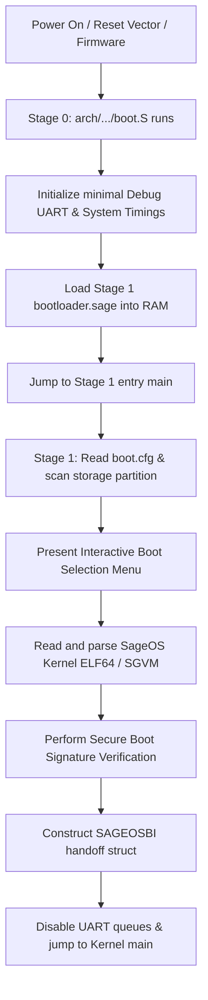

# SageBoot: Unified Bootloader for SageOS


SageBoot is the unified, modular, multi-architecture bootloader for SageOS. It provides standard low-level hardware initialization, memory discovery, configuration parsing, secure kernel validation, and handoff across 7 target architectures.

## Supported Architectures

| Arch | CPU/Platform | Status | Notes |
|------|-------------|--------|-------|
| **rv64** | RISC-V 64 (QEMU Virt, S-mode) | ✅ **Verified** | Boots via OpenSBI, prints banner and RAM test output |
| **arm64** | AArch64 (QEMU Virt) | 🟡 Builds, QEMU WIP | SIMD/FP alignment fault in generated C code |
| **x64** | x86_64 PC (Multiboot v1) | 🟡 Builds, QEMU WIP | Multiboot v1 header not detected by QEMU fw_cfg path |
| **rp2040** | ARM Cortex-M0+ (Raspberry Pi Pico) | 🟦 Builds | No QEMU support for Cortex-M0+ |
| **rp2350_arm** | ARM Cortex-M33 (Raspberry Pi Pico 2) | 🟦 Builds | No QEMU support for Cortex-M33 |
| **rp2350_rv** | RISC-V Hazard3 32-bit (RP2350) | 🟦 Builds | Links with soft-float ABI; custom compiler-rt stubs |
| **mips** | MIPS32 r2 (BCM5357, WN3000RP) | 🟦 Builds | Needs `mipsel-linux-gnu-as` cross-toolchain |

### Test Results

```
$ bash test/test_all.sh
  PASS: 1   FAIL: 3   SKIP: 3   Total: 7

  PASS  rv64        RISC-V 64 QEMU Virt           boots OK
  FAIL  arm64       AArch64 QEMU Virt             no serial output
  FAIL  x64         x86_64 PC (Multiboot)         no serial output
  SKIP  rp2040      RP2040 Cortex-M0+             no QEMU available
  SKIP  rp2350_arm  RP2350 ARM Cortex-M33         no QEMU available
  FAIL  rp2350_rv   RP2350 RISC-V Hazard3         output mismatch
  SKIP  mips        MIPS 74Kc (Netgear WN3000RP)  missing cross-toolchain
```

## Architecture Layout

```
SageBoot/
├── arch/                  # Architecture-specific directories
│   ├── x64/               # x86_64 (PC / Multiboot v1)
│   ├── rv64/              # RISC-V 64 (SBI / Supervisor)
│   ├── arm64/             # AArch64 (ARM64)
│   ├── mips/              # MIPS32 (mipsel / WN3000RP)
│   ├── rp2040/            # RP2040 Cortex-M0+ (Raspberry Pi Pico)
│   ├── rp2350_arm/        # RP2350 Cortex-M33 (Raspberry Pi Pico 2)
│   └── rp2350_rv/         # RP2350 RISC-V Hazard3 (Raspberry Pi Pico 2)
├── compat/                # Cross-platform freestanding C library shims
│   ├── compat.c           # Memory/string/printf + soft-float stubs
│   └── include/           # Standard C header declarations
├── src/                   # Unified Stage 1 Bootloader (Pure SageLang)
│   ├── bootloader.sage    # Main entry, verification, and boot coordinator
│   ├── menu.sage          # Text-mode interactive boot menu UI
│   ├── config.sage        # Config parser for boot.cfg
│   ├── fs_fat.sage        # Minimal FAT12/16/32 directory parser
│   ├── elf.sage           # ELF64 segment loader & entry point detector
│   └── handoff.sage       # Standardized handoff protocol builder
├── test/                  # Test suite
│   └── test_all.sh        # Multi-architecture build + QEMU test runner
├── patch_bootloader.py    # Code patcher for arch-specific boot jump
└── Makefile               # Cross-compilation orchestrator
```

## Key Features

- **7 Target Architectures**: x86_64 (Multiboot v1), AArch64, RISC-V 64 (SBI), MIPS32, RP2040 (Cortex-M0+), RP2350 (ARM & RISC-V)
- **Indentation-Based Logic**: Stage 1 bootloader written in **SageLang** for memory safety and readability
- **Dynamic Boot Menu**: Built-in interactive text menu interface with customizable timeout settings
- **Configuration Parsing**: Reads and parses `boot.cfg` to configure boot parameters dynamically
- **Secure Boot & Verification**: SHA-256 and cryptographic verification stubs for kernel validation
- **ELF64 & SGVM Loader**: Parsers for raw executable ELF segments and VM bytecode containers
- **Unified Boot Handoff**: Standardized `SAGEOSBI` structure passing memory maps, framebuffers, kernel metadata, ACPI RSDP, and boot arguments
- **Soft-Float ABI Support**: Full software IEEE 754 double-precision math for RISC-V 32-bit via `compat.c` stubs

## Building

### Prerequisites

- SageLang compiler (`sage` binary)
- LLVM/clang with cross-compilation targets
- Architecture-specific binutils (`riscv64-linux-gnu-*`, `aarch64-linux-gnu-*`, etc.)

```bash
# Build for a specific architecture
make ARCH=rv64          # RISC-V 64 (default)
make ARCH=x64           # x86_64 Multiboot
make ARCH=arm64         # AArch64
make ARCH=rp2040        # RP2040 Cortex-M0+
make ARCH=rp2350_arm    # RP2350 Cortex-M33
make ARCH=rp2350_rv     # RP2350 RISC-V Hazard3
make ARCH=mips          # MIPS 74Kc
```

The build pipeline:
1. Compiles `src/bootloader.sage` → `bootloader.c` via SageLang C backend
2. Patches `bootloader.c` with arch-specific jump code via `patch_bootloader.py`
3. Assembles `arch/$(ARCH)/boot.S` and compiles C sources with clang (freestanding)
4. Links with `arch/$(ARCH)/linker.ld` → `sageboot.elf` + `sageboot.bin`

### QEMU Testing

```bash
# Run the full test suite
bash test/test_all.sh

# Manual QEMU boot (rv64 example)
qemu-system-riscv64 -machine virt -cpu rv64 -m 512M \
  -bios default -serial stdio -kernel sageboot.bin
```

## Unified Boot Flow



## Documentation

Architecture-specific documentation is available in [`docs/`](docs/):

- [`docs/ARCHITECTURE.md`](docs/ARCHITECTURE.md) – Overall architecture reference
- [`docs/BUILD.md`](docs/BUILD.md) – Detailed build and cross-compilation guide
- [`docs/HACKING.md`](docs/HACKING.md) – Developer guide for adding new architectures

## License

MIT
