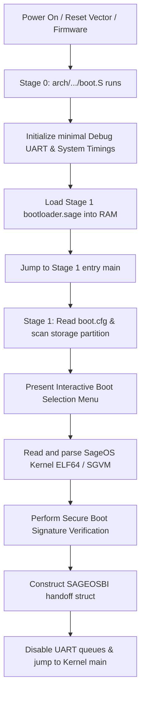

# SageBoot: Unified Bootloader for SageOS


SageBoot is the unified, modular, multi-architecture bootloader for SageOS. It provides standard low-level hardware initialization, memory discovery, configuration parsing, secure kernel validation, and handoff across 8 target architectures.

## Supported Architectures

| Arch | CPU/Platform | Status | Notes |
|------|-------------|--------|-------|
| **rv64** | RISC-V 64 (QEMU Virt, S-mode) | ✅ **Verified** | Boots via OpenSBI, prints banner and RAM test output |
| **arm64** | AArch64 (QEMU Virt) | 🟡 Builds, QEMU WIP | SIMD/FP alignment fault in generated C code |
| **x64** | x86_64 PC (Multiboot v1) | 🟡 Builds, QEMU WIP | Multiboot v1 header not detected by QEMU fw_cfg path |
| **rp2040** | ARM Cortex-M0+ (Raspberry Pi Pico) | 🟦 Builds | No QEMU support for Cortex-M0+ |
| **rp2350_arm** | ARM Cortex-M33 (Raspberry Pi Pico 2) | 🟦 Builds | No QEMU support for Cortex-M33 |
| **rp2350_rv** | RISC-V Hazard3 32-bit (RP2350) | 🟦 Builds | Links with soft-float ABI; custom compiler-rt stubs |
| **mips** | MIPS32 r2 (BCM5357, WN3000RP) | 🟦 Builds | Needs `mipsel-linux-gnu-as` cross-toolchain |
| **esp32** | Xtensa LX6 (ESP32-D0WD-V3 / ESP-WROOM-32) | 🟦 Builds | **Builds cleanly; not yet run on hardware.** Toolchain is not on `PATH` |

### Test Results

The table above was written when rv64 booted under QEMU. That is no longer true,
and the numbers below are current:

```
$ bash test/test_all.sh
  PASS: 0   FAIL: 6   SKIP: 2   Total: 8

  FAIL  rv64        RISC-V 64 QEMU Virt           build failed
  FAIL  arm64       AArch64 QEMU Virt             build failed
  FAIL  x64         x86_64 PC (Multiboot)         build failed
  FAIL  rp2040      RP2040 Cortex-M0+             build failed
  FAIL  rp2350_arm  RP2350 ARM Cortex-M33         build failed
  FAIL  rp2350_rv   RP2350 RISC-V Hazard3         build failed
  SKIP  mips        MIPS 74Kc (Netgear WN3000RP)  missing cross-toolchain
  SKIP  esp32       ESP32 Xtensa LX6              no QEMU available
```

**All six previously-working architectures now fail to build.** This is
pre-existing, not caused by the esp32 port: verified by stashing the esp32
changes and building at HEAD, where rv64 and rp2040 fail identically with 17
errors each. The cause is the `sage` compiler, not this tree. The current
`/usr/local/bin/sage` emits C11 atomics (`atomic_load_explicit`,
`memory_order_acquire`, `atomic_fetch_add_explicit`, ...) that these builds
cannot satisfy: the arch configs are compiled by clang with `-target` and
`-nostdlibinc`, where `<stdatomic.h>` is not reachable, and `compat/include/`
has a `stdatomic.h` that the emitted C does not include. Implicit function
declarations are an error under the current clang defaults, so it fails hard.

Fixing that means either teaching `compat/include/stdatomic.h` to provide real
single-core definitions, or adding GCC-style builtin-include paths the way the
esp32 target does. **The esp32 target builds today precisely because it does
not go through clang**: the Xtensa GCC supplies `<stdatomic.h>` itself, and the
Makefile adds `-nostdinc` plus that directory back explicitly. So the esp32
port is currently the only architecture in the tree that builds.

**esp32 is a build, not a verified boot.** It has not been flashed or run.

## Architecture Layout

```
SageBoot/
├── arch/                  # Architecture-specific directories
│   ├── x64/               # x86_64 (PC / Multiboot v1)
│   ├── rv64/              # RISC-V 64 (SBI / Supervisor)
│   ├── arm64/             # AArch64 (ARM64)
│   ├── mips/              # MIPS32 (mipsel / WN3000RP)
│   ├── rp2040/            # RP2040 Cortex-M0+ (Raspberry Pi Pico)
│   ├── rp2350_arm/        # RP2350 Cortex-M33 (Raspberry Pi Pico 2)
│   ├── rp2350_rv/         # RP2350 RISC-V Hazard3 (Raspberry Pi Pico 2)
│   └── esp32/             # ESP32 Xtensa LX6 (classic ESP32, D0WD-V3)
├── compat/                # Cross-platform freestanding C library shims
│   ├── compat.c           # Memory/string/printf + soft-float stubs
│   └── include/           # Standard C header declarations
├── src/                   # Unified Stage 1 Bootloader (Pure SageLang)
│   ├── bootloader.sage    # Main entry, verification, and boot coordinator
│   ├── menu.sage          # Text-mode interactive boot menu UI
│   ├── config.sage        # Config parser for boot.cfg
│   ├── fs_fat.sage        # Minimal FAT12/16/32 directory parser
│   ├── elf.sage           # ELF64 segment loader & entry point detector
│   └── handoff.sage       # Standardized handoff protocol builder
├── test/                  # Test suite
│   └── test_all.sh        # Multi-architecture build + QEMU test runner
├── patch_bootloader.py    # Code patcher for arch-specific boot jump
└── Makefile               # Cross-compilation orchestrator
```

## Key Features

- **8 Target Architectures**: x86_64 (Multiboot v1), AArch64, RISC-V 64 (SBI), MIPS32, RP2040 (Cortex-M0+), RP2350 (ARM & RISC-V), ESP32 (Xtensa LX6)
- **Indentation-Based Logic**: Stage 1 bootloader written in **SageLang** for memory safety and readability
- **Dynamic Boot Menu**: Built-in interactive text menu interface with customizable timeout settings
- **Configuration Parsing**: Reads and parses `boot.cfg` to configure boot parameters dynamically
- **Secure Boot & Verification**: SHA-256 and cryptographic verification stubs for kernel validation
- **ELF64 & SGVM Loader**: Parsers for raw executable ELF segments and VM bytecode containers
- **Unified Boot Handoff**: Standardized `SAGEOSBI` structure passing memory maps, framebuffers, kernel metadata, ACPI RSDP, and boot arguments
- **Soft-Float ABI Support**: Full software IEEE 754 double-precision math for RISC-V 32-bit via `compat.c` stubs

## Building

### Prerequisites

- SageLang compiler (`sage` binary)
- LLVM/clang with cross-compilation targets
- Architecture-specific binutils (`riscv64-linux-gnu-*`, `aarch64-linux-gnu-*`, etc.)

```bash
# Build for a specific architecture
make ARCH=rv64          # RISC-V 64 (default)
make ARCH=x64           # x86_64 Multiboot
make ARCH=arm64         # AArch64
make ARCH=rp2040        # RP2040 Cortex-M0+
make ARCH=rp2350_arm    # RP2350 Cortex-M33
make ARCH=rp2350_rv     # RP2350 RISC-V Hazard3
make ARCH=mips          # MIPS 74Kc
```

The build pipeline:
1. Compiles `src/bootloader.sage` → `bootloader.c` via SageLang C backend
2. Patches `bootloader.c` with arch-specific jump code via `patch_bootloader.py`
3. Assembles `arch/$(ARCH)/boot.S` and compiles C sources with clang (freestanding)
4. Links with `arch/$(ARCH)/linker.ld` → `sageboot.elf` + `sageboot.bin`

### QEMU Testing

```bash
# Run the full test suite
bash test/test_all.sh

# Manual QEMU boot (rv64 example)
qemu-system-riscv64 -machine virt -cpu rv64 -m 512M \
  -bios default -serial stdio -kernel sageboot.bin
```

## Unified Boot Flow


```mermaid
graph TD
    A[Power On / Reset Vector / Firmware] --> B[Stage 0: arch/.../boot.S runs]
    B --> C[Initialize minimal Debug UART & System Timings]
    C --> D[Load Stage 1 bootloader.sage into RAM]
    D --> E[Jump to Stage 1 entry main]
    E --> F[Stage 1: Read boot.cfg & scan storage partition]
    F --> G[Present Interactive Boot Selection Menu]
    G --> H[Read and parse SageOS Kernel ELF64 / SGVM]
    H --> I[Perform Secure Boot Signature Verification]
    I --> J[Construct SAGEOSBI handoff struct]
    J --> K[Disable UART queues & jump to Kernel main]
```

## Documentation

Architecture-specific documentation is available in [`docs/`](docs/):

- [`docs/ARCHITECTURE.md`](docs/ARCHITECTURE.md) – Overall architecture reference
- [`docs/BUILD.md`](docs/BUILD.md) – Detailed build and cross-compilation guide
- [`docs/HACKING.md`](docs/HACKING.md) – Developer guide for adding new architectures

## License

MIT

## ESP32 (Xtensa LX6)

`ARCH=esp32`. Everything in `arch/esp32/` is derived from hardware facts
verified on a real ESP32-D0WD-V3 rather than recalled:

- `config.sage` — UART0 is `0x3FF40000`, and the **status register is at
  `+0x1C`, not `+0x04`**. The same register serves both directions the Sage
  sources need: bit 0 is `rxfifo_full` (what `menu.sage` polls) and bits 23:16
  are `txfifo_cnt`. Writing to `+0x1C` pokes `txfifo_cnt` and the
  write-1-to-clear interrupt bits and wedges the console, which looks exactly
  like a firmware bug — it cost two debugging rounds before being pinned down.
  Also defines `UART0_DATA`, `UART0_LSR` and `FLASH_BASE`, which
  `bootloader.sage` and `menu.sage` reference but which **only the mips config
  previously defined**; every other architecture was missing them.
- `boot.S` — disarms the RTC, TG0 and TG1 watchdogs before anything else. The
  ROM leaves all three armed and an image that does not disarm them is reset
  before producing any output, which is indistinguishable from a failed image
  load. Sets both `a1` and `a15`, because in the Xtensa windowed ABI `a15` is
  the callee-saved stack pointer but every prologue's `entry a1, N` pushes onto
  `a1`; setting only `a15` leaves nested calls walking off the end of whatever
  the ROM left there. The entry is a single `j` stepping over the literal pool,
  since `l32r` resolves only backwards and the ROM jumps to the start of the
  loaded segment. All peripheral addresses come from the literal pool rather
  than shift-built immediates: `movi` is 12-bit and `addi` 8-bit, so `0x3ff480a4`
  cannot be formed by either.
- `linker.ld` — IRAM0 at `0x40080000` for code and the `.data` initialisers,
  and the single contiguous DRAM block `0x3FFCE000`–`0x40000000` for
  `.bss`/heap/stack. Internal DRAM begins at `0x3FFB0000` and has a hole from
  `0x3FFB6000` to `0x3FFCE000`. Two earlier ESP32 maps in this project treated
  `0x3FFB0000` as 320 KB of "IRAM0" and `0x3FF80000` as DRAM; neither is true,
  and because the ROM loader will write a `.data` image anywhere, both link and
  flash cleanly and only fail at run time.

The Xtensa toolchain ships with the Arduino ESP32 core rather than on `PATH`:

```bash
make ARCH=esp32                          # uses the default prefix
make ARCH=esp32 XTENSA_PREFIX=/opt/xtensa
```

### Known limitation: `bootloader.sage` assumes a large-RAM target

`src/bootloader.sage` is written for the QEMU targets and is **not yet correct
for a real ESP32**:

- It looks for the kernel at `hw.RAM_START + 0x01000000` — a 16 MB offset. The
  ESP32 has 520 KB of internal SRAM in total, so that address is unmapped. The
  app partition is at flash offset `0x10000`, i.e. `0x40010000` through DROM,
  which is what `KERNEL_LOAD_ADDR` is set to in `arch/esp32/config.sage`.
- It reads a hardcoded `boot.cfg` string rather than the real partition table
  that `gen_partitions.py` writes at `0x8000`.
- The only `FLASH_BASE`-based load path is the mips TRX one, guarded by
  `if hw.ARCH_NAME == "mips"`.

`src/bootloader.sage` is shared by every architecture, so giving esp32 different
loader logic means either a per-arch loader source or moving the
kernel-location decision behind a `config.sage` hook. That refactor is the
remaining work before the ESP32 port can actually boot something, and it is
deliberately not done here.
